# ВАМ ДЕЙСТВИТЕЛЬНО СТОИТ ЭТО ПРОЧЕСТЬ 😉

---
Данный проект реализован с использованием принципов гексагональной архитектуры. [(подробнее)](https://github.com/VanderSVan/Clean_Architecture/tree/main)

---
## Быстрый старт

1. [Задание](#что-нужно-сделать): Подробное описание задания.
1. [Пошаговое руководство по развертыванию](#пошаговое-руководство-по-развертыванию): Детальные инструкции по запуску проекта.
2. [Карта доступных ресурсов](#карта-доступных-ресурсов-проекта): Навигация по всем endpoint'ам и интерфейсам проекта.
3. [Подробный гайд взаимодействия](#а-шо-а-куда-тыкать): Пошаговый гайд использования данного проекта.

---
## Что нужно сделать?
Цель данного задания - реализовать интеграционный сервис, который получает задачи для обработки в топике брокера и запрашивает информацию по API.
Сервис должен быть реализован с помощью фреймворков FastAPI.

### Что ожидается в качестве результат?
В качестве решения ожидается сервис, который можно будет запустить с docker-compose.yaml.
Сервис способен получать сообщения как в топик брокера (в качестве брокера возможно использование Apache Kafka или RabbitMQ), так и в качестве REST-запроса.
Формат данных одинаковый для обоих случаев.
Далее ходить за информацией по API в сторонние сервисы.
В качестве конечного результата сервис должен сделать запись в бд с полученными данными и отправить id записи в топик брокера.

Сервис должен будет обращаться к API Dadata для проверки телефона (описание API - https://dadata.ru/api/clean/phone/),
стандартизация email адресов (описание API - https://dadata.ru/api/clean/email/),
а также отправка запросов YandexGPT (описание API - https://yandex.cloud/en/docs/foundation-models/concepts/yandexgpt/).

Входящий данные будут иметь следующий формат json:

```json
{
    "task_id": "number",
    "task_type": "enum: phone, email, gpt",
    "data": "string"
}
```

В ответ сервис должен будет возвращать следующий json:

```json
{
    "task_id": "number",
    "id": "number"
}
```
Все данные сервис складывает в БД в таблицу integration_service с колонками:
- id - первичный ключ
- data - полученные данные от сервисов
- task_type - тип задачи ("enum: phone, email, gpt")

---
## Пошаговое руководство по развертыванию
Для запуска проекта следуйте этим шагам:

1. Начните с создания файла конфигурации окружения:
   - Скопируйте файл [`components/backend/.env.example`](components/backend/.env.example) в `components/backend/.env`
   - Отредактируйте `.env`, установив необходимые значения для вашей среды

2. Перейдите в директорию с инструментами управления:
    ```
    cd deployment/backend/
    ```

3. Запустите проект, с помощью данной команды:
    ```
         bash ./manage/start.sh --dev
    ```

Эта команда инициируют процесс сборки и запуска всех необходимых сервисов в Docker-контейнерах.

Для полного контроля над жизненным циклом приложения ознакомьтесь с [полным списком команд управления](./deployment/backend/manage/README.md), включающим инструкции по остановке, перезапуску и удалению компонентов проекта.

_P.S. Для данного мини проекта доступна только dev сборка.  
Если Вам интересно взглянуть на более сложные настройки деплоя проекта, милости прошу тыкнуть ниже:_
1) [bash-скрипты](https://github.com/VanderSVan/Clean_Architecture/tree/main/deployment/backend/entrypoints)
2) [Dockerfile и docker compose](https://github.com/VanderSVan/Clean_Architecture/tree/main/deployment/backend)
3) [nginx конфигурации](https://github.com/VanderSVan/Clean_Architecture/tree/main/deployment/backend/nginx_config)
4) [управление проектом](https://github.com/VanderSVan/Clean_Architecture/tree/main/deployment/backend/manage)

[К навигации по проекту](#быстрый-старт)

---
## Карта доступных ресурсов проекта
После успешного развертывания вам будут доступны следующие ресурсы:

- **API**: 
  - Основной интерфейс для взаимодействия с бэкендом
  - http://0.0.0.0:9000/api/v1
- **Swagger UI**: 
  - Интерактивная документация API (доступно только в среде разработки)
  - http://0.0.0.0:9000/api/v1/docs
- **Redoc UI**:
  - Альтернативная интерактивная документация API с другим интерфейсом
  - http://0.0.0.0:9000/api/v1/redoc
- **PgAdmin**: 
  - Веб-интерфейс для управления базой данных PostgreSQL
  - http://0.0.0.0:5050/
- **Web RabbitMQ**:
  - Веб-интерфейс для мониторинга и управления RabbitMQ (сообщениями и очередями)
  - http://0.0.0.0:15672/

**!!! ОСТОРОЖНО !!!** - Не забывайте, если Вы изменили порты в `components/backend/.env` файле со стандартных, то не забудьте обновить URL ресурсов.

[К навигации по проекту](#быстрый-старт)

---
## А шо? А куда тыкать?
### 1. Для начала Вам необходимо [развернуть проект](#пошаговое-руководство-по-развертыванию). _(Если что-то пошло не так, свяжитесь со мной.)_

### 2. Далее можно начать с настройки pgadmin. Перейдите к [pgadmin](http://0.0.0.0:5050/) и авторизуйтесь. По умолчанию Login=`test@domain.com` password=`123456`.
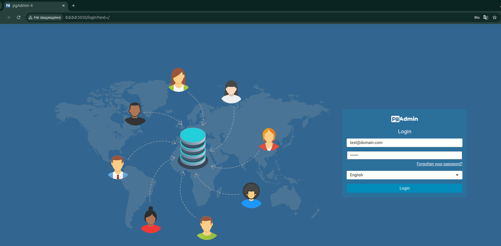  

### 3. Далее необходимо зарегистрировать сервер. Нажмите на кнопку `Add New Server` 
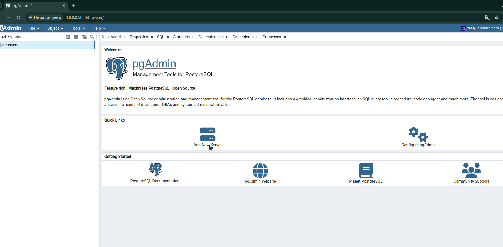  

### 4. Имя можно указать любое.  
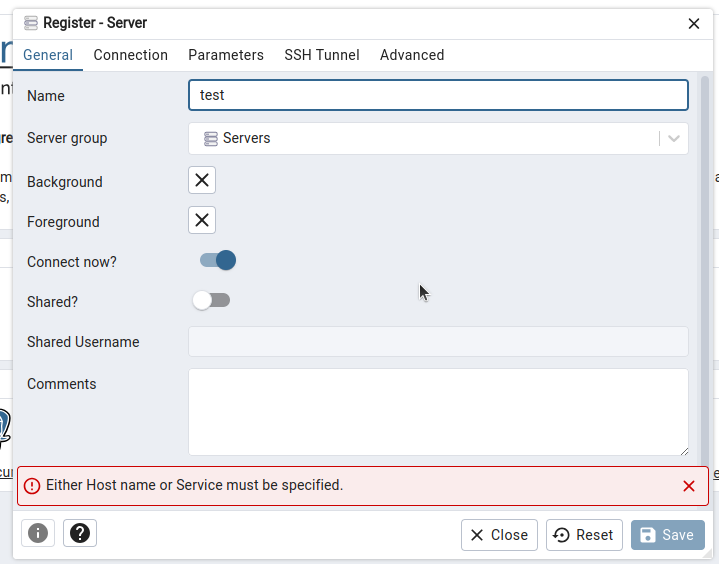  

### 5. Перейдите на вкладку **Connection**. **Host name/address** укажите `db`. **Username** - `postgres`. **Password** - `postgres`. Нажмите на кнопку **Save**.  
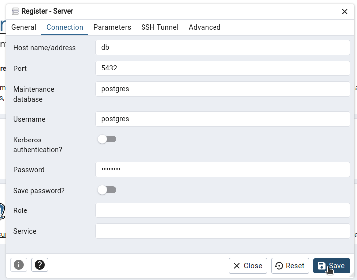  

### 6. Вам уже должна быть доступна бд `test_validator` и таблица `integration_service`.  
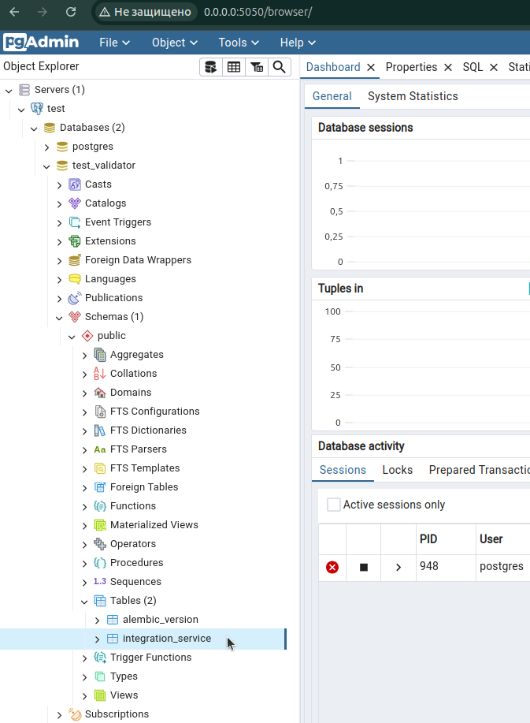  

### 7. Убедитесь, что `alembic` отработал и таблица имеет структуру.  
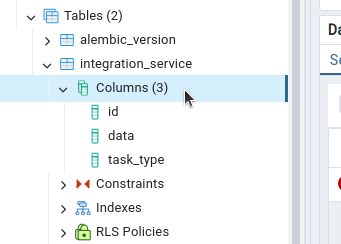  

### 8. Отлично. Далее советую перейти к **api swagger**. Перейдите по ссылке [http://0.0.0.0:9000/api/v1/docs](http://0.0.0.0:9000/api/v1/docs).  
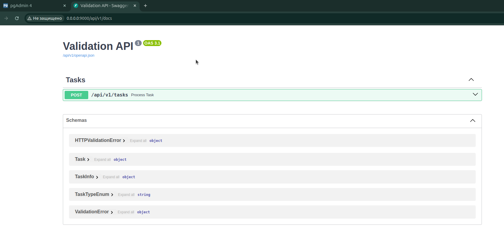  

### 9. Измените **body** на свое усмотрение и отправьте запрос, нажав на **Execute**.
```json
{
  "task_id": 1,
  "task_type": "phone",
  "data": "1234567890"
}
```  
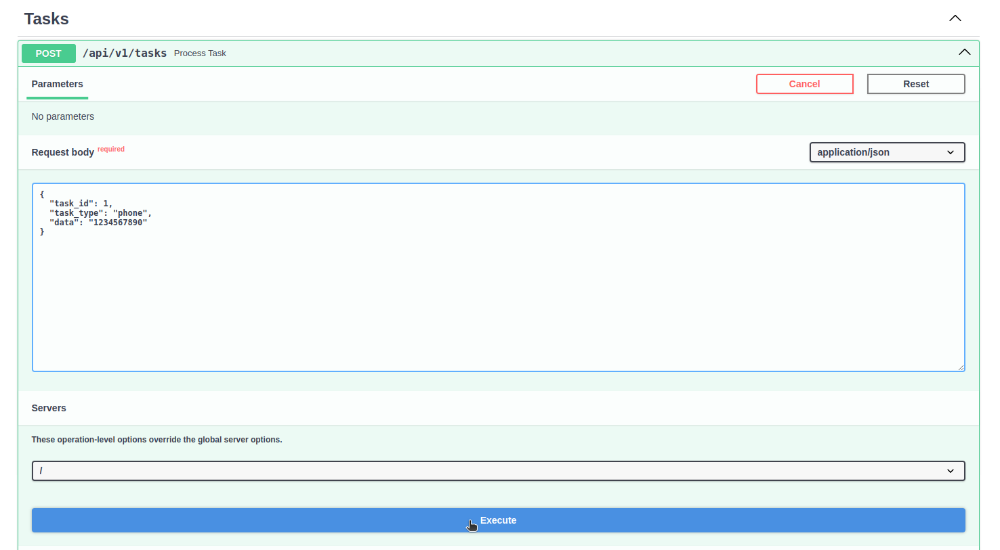  

### 10. В ответ Вы должны получить нечто подобное.  
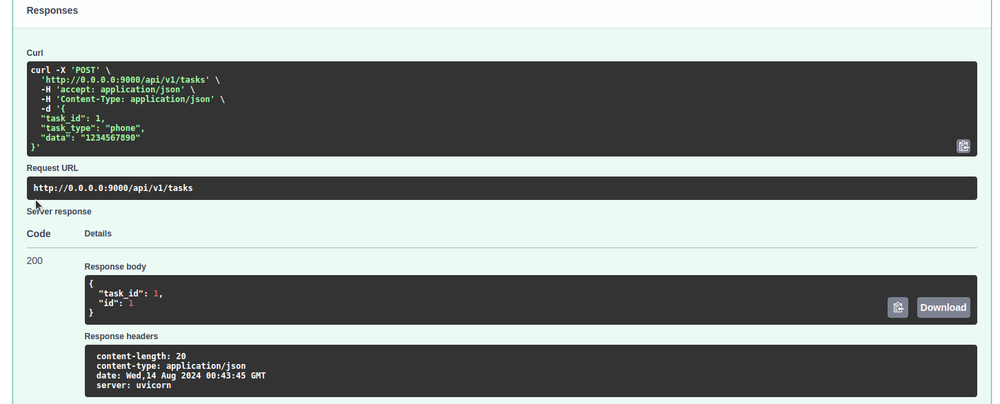

### 11. Проделайте аналогичное для `"task_type": "email"` и для `"task_type": "gpt"`  
```json
{
  "task_id": 2,
  "task_type": "email",
  "data": "some_email@domain.com"
}
```
```json
{
  "task_id": 3,
  "task_type": "gpt",
  "data": "Здрасте"
}
```

### 12. Далее перейдите на веб интерфейс "кролика" по ссылке [http://0.0.0.0:15672/](http://0.0.0.0:15672/). По умолчанию **login** - `guest`, **password** - `guest`.  
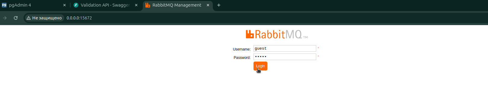

### 13. Видим, что все 3 наших запроса отработали и находятся в конечной очереди.
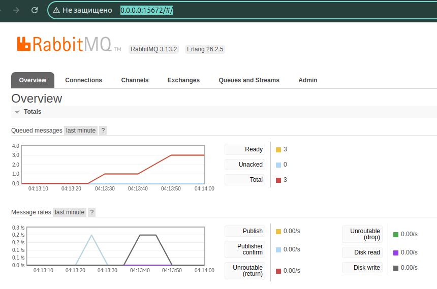

### 14. Далее перейдем на вкладку [**Queues and Streams**](http://0.0.0.0:15672/#/queues)
Видим, что существует 2 очереди - `TaskProcessingQueue` и `TaskResultDeliveryQueue`.
- Основная очередь - `TaskProcessingQueue`, в ней хранятся объекты поступающие на обработку к данному сервису в формате:
```json
{
    "task_id": "number",
    "task_type": "enum: phone, email, gpt",
    "data": "string"
}
```
- Очередь `TaskResultDeliveryQueue` сделана для наглядности в ней хранятся объекты в формате:
```json
{
    "task_id": "number",
    "id": "number"
}
```
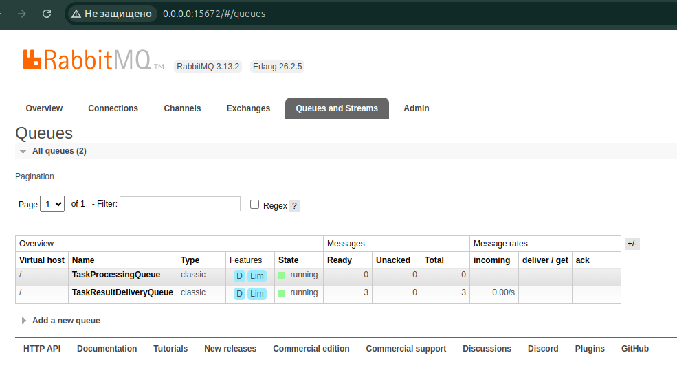

### 15. Чтобы протестировать работу воркера вне api проделайте следующие операции:
- Нажмите на очередь [`TaskProcessingQueue`](http://0.0.0.0:15672/#/queues/%2F/TaskProcessingQueue)
- Перейдите под спойлер `Publish message`
- В окне `Payload` поместите подобный json:
```json
{
  "task_id": 4,
  "task_type": "phone",
  "data": "0123654789"
}
```
- Нажмите на кнопку `Publish message`  
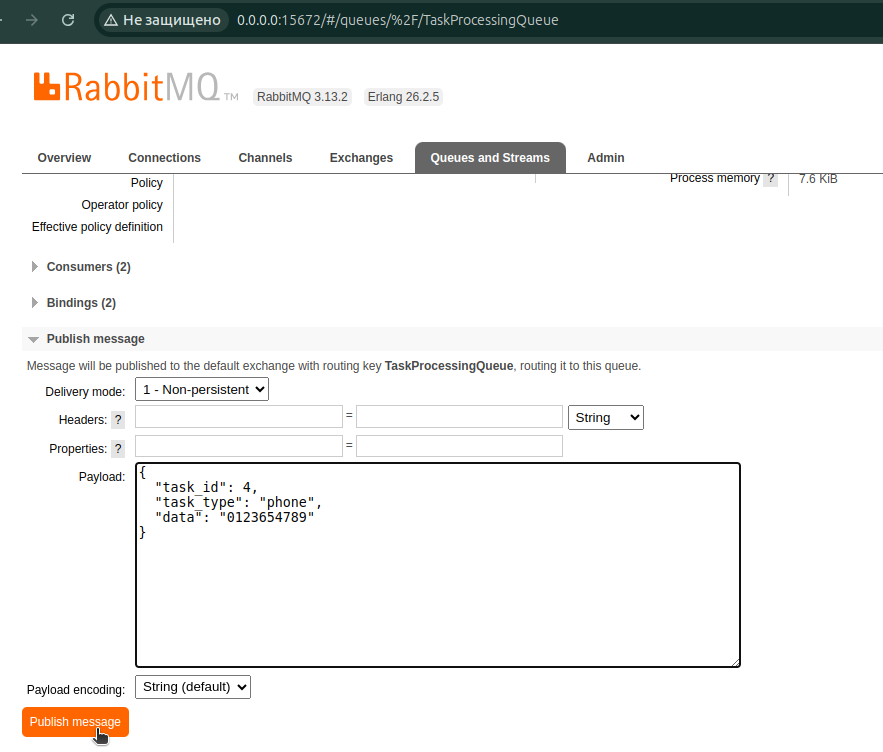  

### 16. Вернувшись обратно к [очередям](http://0.0.0.0:15672/#/queues), Вы должны увидеть что в очереди `TaskResultDeliveryQueue` пополнение :)
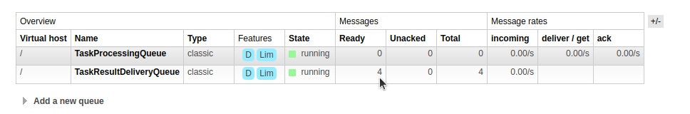

### 17. Чтобы очистить очередь [`TaskResultDeliveryQueue`](http://0.0.0.0:15672/#/queues/%2F/TaskResultDeliveryQueue):
- Нажмите на очередь [`TaskResultDeliveryQueue`](http://0.0.0.0:15672/#/queues/%2F/TaskResultDeliveryQueue)
- Перейдите под спойлер `Get messages`
- В `Ack Mode` выберите `Automatic ack`
- Нажмите на кнопку `Get Message(s)` (можно повторить 4 раза в данном случае)  
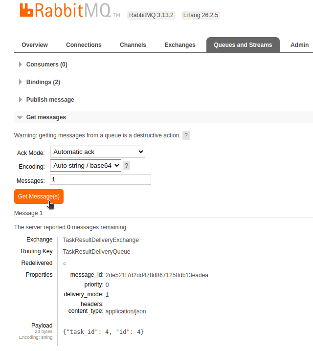

### 18. Напоследок вернемся в бд, чтобы проверить записи.
- Выполняем простой запрос:
```sql
SELECT * FROM public.integration_service
ORDER BY id ASC 
```
- И видим наши 4 строчки  
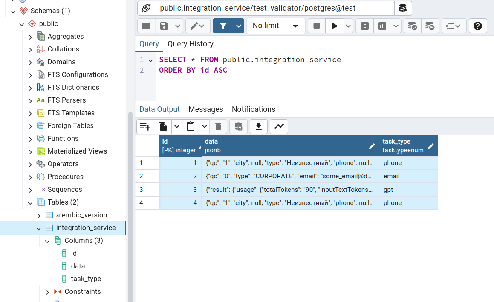

[К навигации по проекту](#быстрый-старт)

---
_Вау, Вы действительно дошли до сюда? В таком случае я благодарен Вам, что уделили время 🙂._


